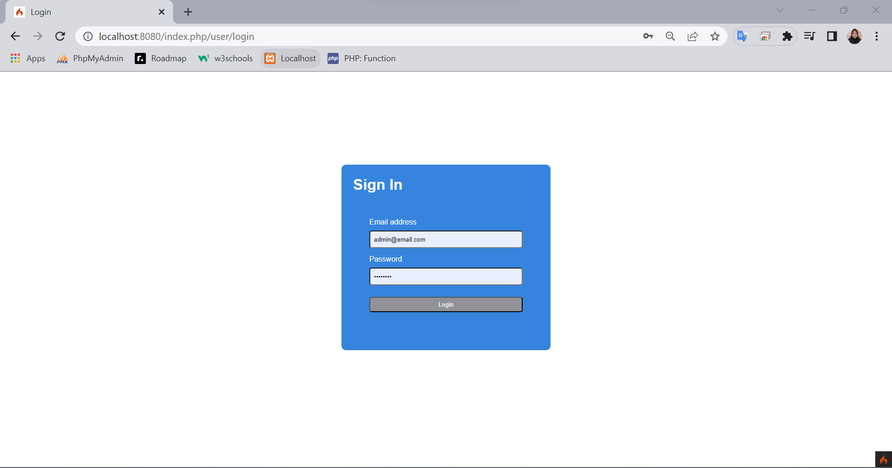
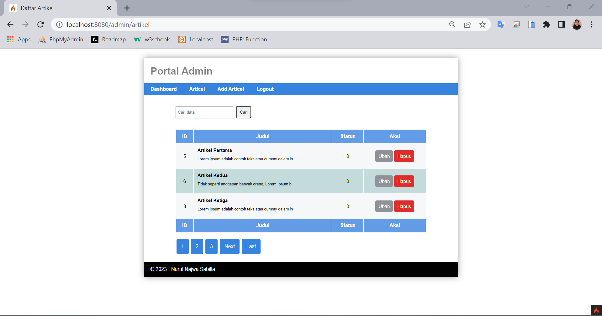
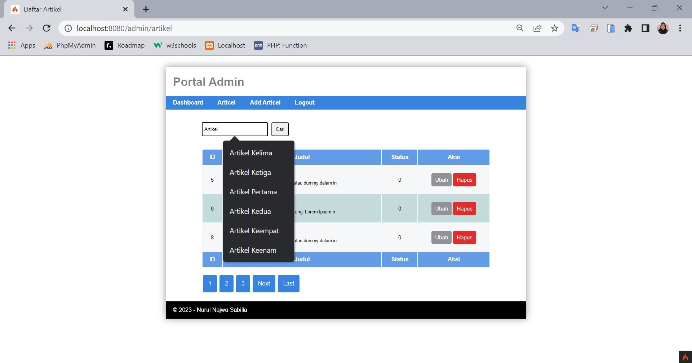
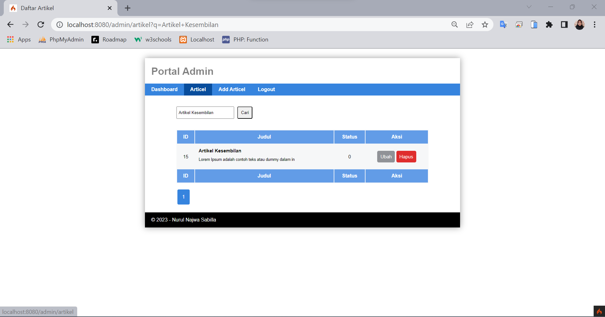
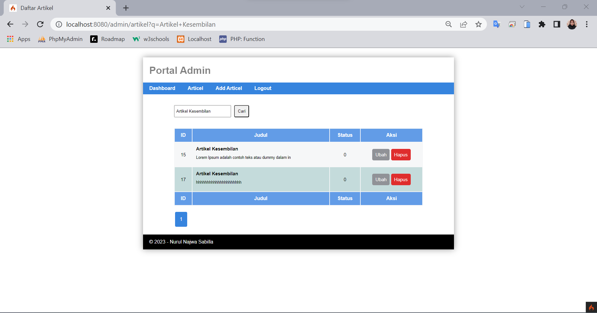
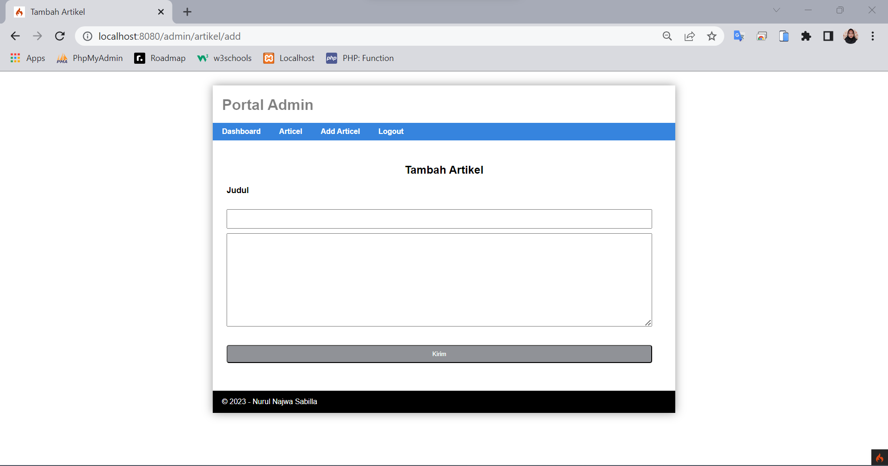
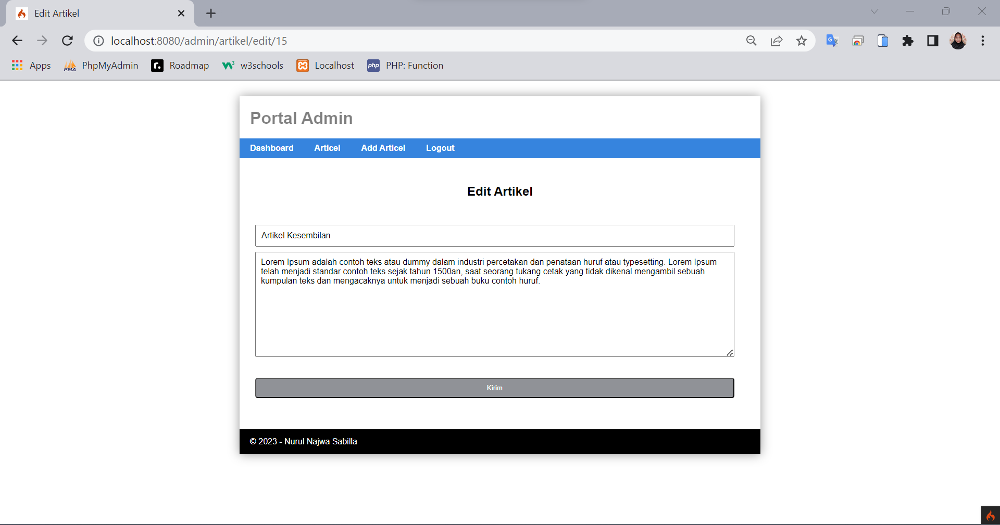
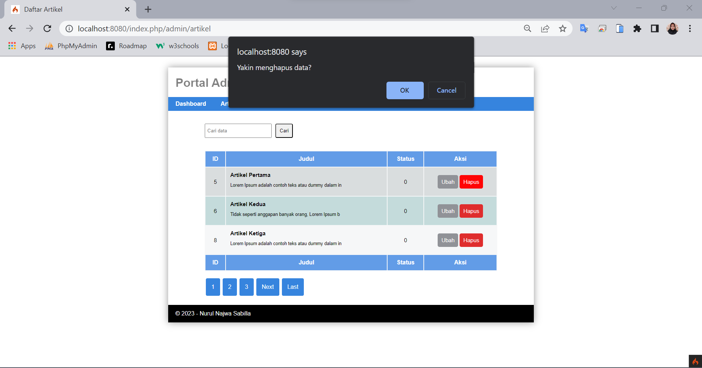

# Praktikum 10: Pagination dan Pencarian

```bash
Nama    : Nurul Najwa Sabilla
Kelas   : TI.21.A.3
Nim     : 312110451
```

## Output

```bash
Output terbaru dengan adanya tampilan pagination dan Pencarian
```

## Menu Admin

1. Sign In u/ Admin



2. Halaman Artikel Admin Terbaru dengan Tampilan Pagination & Pencarian



3. Pencarian Data Artikel dengan Mengisi TextField



4. Contoh Pencarian Data akan Menampilkan Data yang Dituju





5. Tambah Artikel Terbaru



6. Ubah Data Artikel Terbaru



7. Hapus Artikel Terbaru




## Terimkasih(●'◡'●)